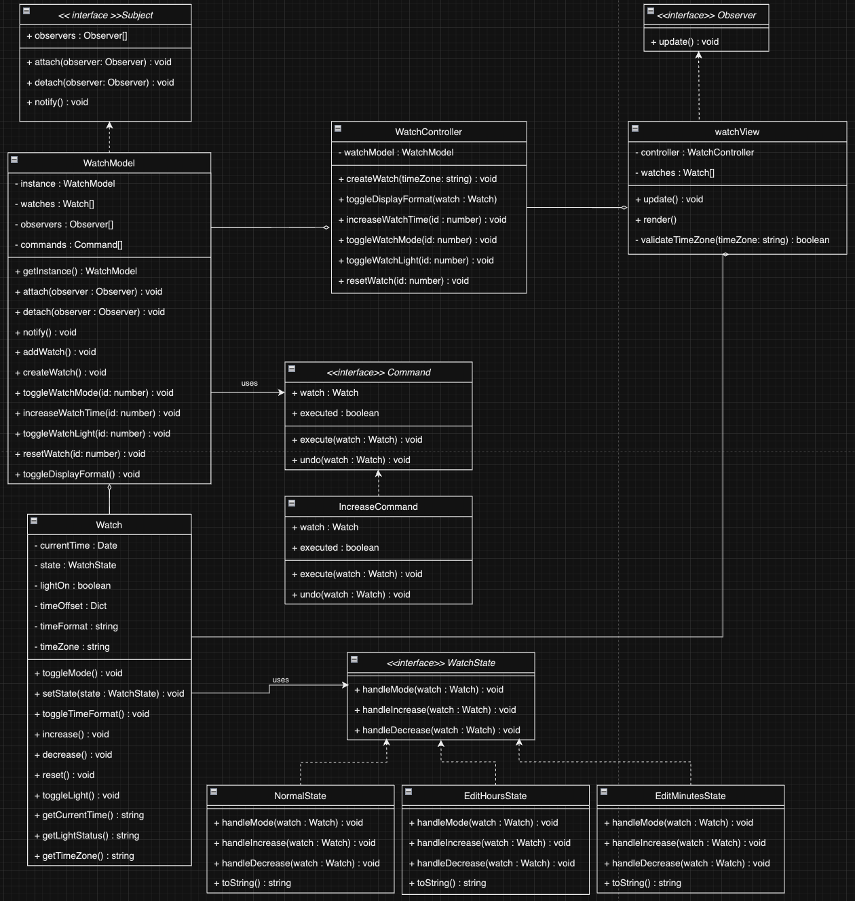

# template-ts
Template typescript project
My solution for GEHC Technical test.
Implemented in vanilla Typescript and Tailwind CSS.
[Live link](https://gehc.dhia.dev/)

### Implemented functionalities
- ~~Part A~~  (Done)
    - Watch logic / View
    - Mode / Increase / Light buttons
- ~~Part B~~ (Done)
    - Dynamic creation of watches with timezones
    - Multiple watches view
    - Time format toggling (24h / 12h)

### Class diagram


### Execution
```javascript
npm install
npm run build
npm run start
```